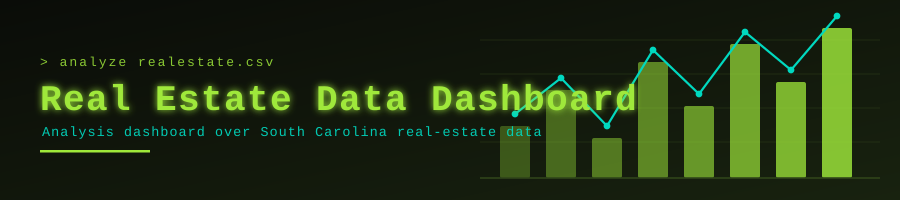

<p align="center">
  
</p>

<p align="center">
  
</p>

<p align="center">
  <a href="https://github.com/muqeetahmaad9/data-science-dashboard/stargazers"></a>
  <a href="https://github.com/muqeetahmaad9/data-science-dashboard/commits"></a>
  
</p>

---

### 📖 Overview

An interactive dashboard exploring a 2025 South Carolina real-estate dataset — price distributions, geography and market trends.

### ✨ Features

- Loads and cleans the real-estate CSV
- Interactive charts and filters
- Sample dataset included for immediate use

### 🧰 Built With

<p align="left">
  
</p>

### 🚀 Getting Started

```bash
pip install -r requirements.txt
python dashboard.py
```

### 👤 Author

**Muqeet Ahmad** — AI/ML Engineer · IoT & Embedded Systems Builder

<p align="left">
  <a href="https://www.linkedin.com/in/muqeet--ahmad/"></a>
  <a href="https://muqeetahmaad-portfolio.netlify.app/"></a>
  <a href="mailto:muqeetahmad155@gmail.com"></a>
</p>

<p align="center">
  
</p>
